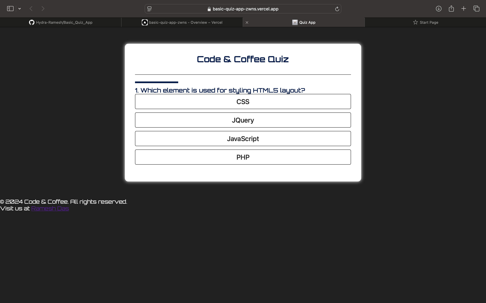

## **Code & COffee Quiz App** 

This is a simple quiz app built using HTML, CSS, and JavaScript. Users can answer multiple-choice questions and receive instant feedback on their answers.

## Features

- **Multiple Choice Questions**: Users can select answers from a list of options.
- **Feedback**: After answering a question, users receive immediate feedback (correct or incorrect).
- **Score Tracking**: The app keeps track of the user's score.
- **Responsive Design**: The app works well on different devices.

## Screenshot

